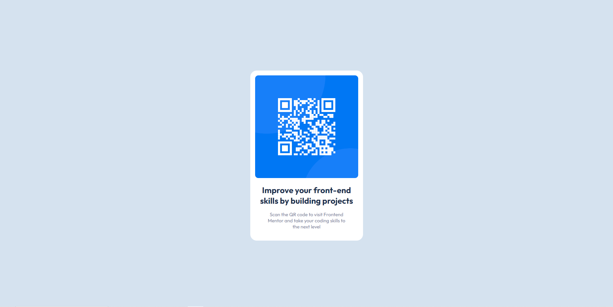

# Frontend Mentor - QR code component solution

This is a solution to the [QR code component challenge on Frontend Mentor](https://www.frontendmentor.io/challenges/qr-code-component-iux_sIO_H). Frontend Mentor challenges help you improve your coding skills by building realistic projects. 

## Table of contents

- [Overview](#overview)
  - [Screenshot](#screenshot)
  - [Links](#links)
- [My process](#my-process)
  - [Built with](#built-with)
  - [What I learned](#what-i-learned)
  - [Continued development](#continued-development)
- [Author](#author)

## Overview

### Screenshot

### Links

- Solution URL: (https://www.frontendmentor.io/solutions/qr-code-using-html-and-css-ypNpdFGeNt)
- Live Site URL: (https://main--eye0001-qr-code-solution.netlify.app/)

## My process

  Used HTML and CSS to complete.

### Built with

- Semantic HTML5 markup
- CSS custom properties
- Flexbox

### What I learned

I learned how to use flexbox more thoroughly.

### Continued development

  I would like to continue to use and learn flexbox to complete other challenges in the future.

## Author

- Frontend Mentor - [@Eye0001](https://www.frontendmentor.io/profile/Eye0001)

